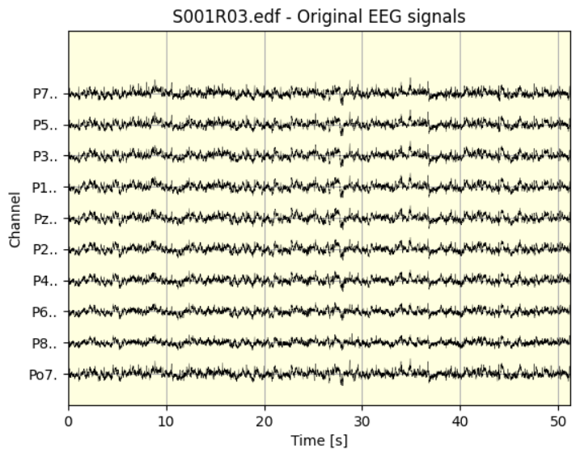
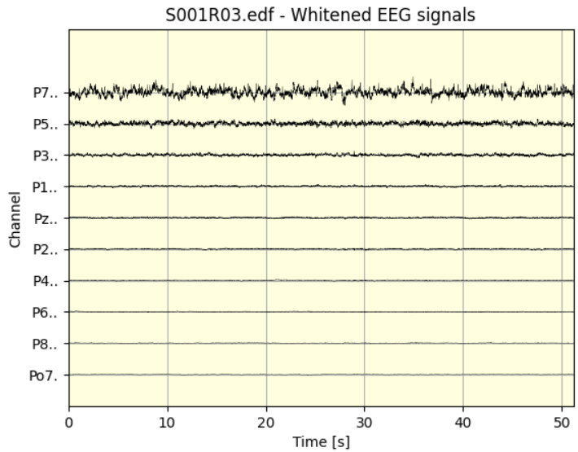
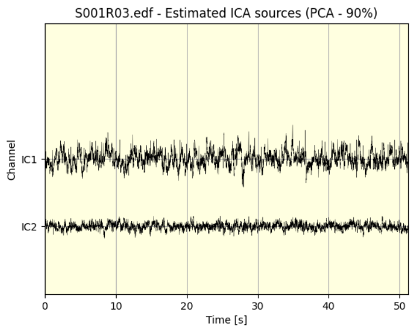

# 🎧 EEG Signal Separation using FastICA

This project explores how **Independent Component Analysis (ICA)**, specifically **FastICA**, can be used to separate statistically independent sources from multichannel **EEG signals** — a crucial preprocessing step in neuroscience, BCI, and mental health applications.

---

## 🧠 Motivation

Electroencephalography (EEG) data often contains **mixed signals** from different brain regions and non-neural sources (e.g., muscle movement, eye blinks). To make sense of this complex data, it's essential to **separate the underlying sources** — ideally into independent neural components.

This project demonstrates how FastICA can do just that, through:

- Whitening the data  
- Maximizing non-Gaussianity  
- Reconstructing statistically independent components

---

## 🔍 Project Overview

- **Data**: EEG signal from 10 channels (simulated or anonymized patient data)  
- **Goal**: Recover the original sources that generated the observed EEG signals  
- **Method**: Custom implementation of **FastICA**  
- **Output**: Visualization of  
  - Original mixed signals  
  - Whitened signals  
  - Estimated independent components  

---

## 🧪 Methods

The steps are as follows:

1. **Preprocessing**
   - Mean-centering
   - Whitening using eigen-decomposition

2. **FastICA Algorithm**
   - Iterative estimation of independent components using fixed-point updates
   - Non-linearity used: `g(u) = tanh(u)`

3. **Validation**
   - Visual inspection of separated signals
   - Statistical independence confirmed via contrast functions and visual comparison

---

## 📊 Visual Results

You’ll find three key plots in the output:

1. **Original EEG signals** (10-channel mixed signals)

  

  
  

2. **Whitened signals** (decorrelated, unit-variance signals)
   
  

  
  

3. **Estimated Sources** (statistically independent components)  

  

  
  

These visuals clearly illustrate the transformation at each stage of the algorithm.

## 🔍 Interpretation and Significance

The above visualizations illustrate the critical stages of the Independent Component Analysis (ICA) process applied to multichannel EEG data:

- **Original EEG Signals:** This plot shows the raw recordings from ten EEG channels. As expected, these signals are mixtures of various brain activities and external artifacts, making direct analysis challenging.

- **Whitened Signals:** Whitening transforms the original data to remove correlations and equalize variance across channels. This step simplifies the subsequent separation by preparing the signals to be statistically uncorrelated and standardized.

- **Estimated Independent Components:** The final plot displays the separated sources extracted by ICA. Each component represents a statistically independent signal that ideally corresponds to distinct physiological or artifact-related sources.

### Why This Matters

Separating independent components from EEG signals is fundamental in numerous neuroscience and clinical applications. By isolating meaningful brain activity from noise and artifacts, ICA enhances:

- **Seizure Detection:** Improving automated identification of epileptic events.
- **Brain-Computer Interfaces (BCIs):** Enabling more accurate decoding of user intent from neural signals.
- **Cognitive and Mental State Analysis:** Providing cleaner data to study brain function and mental health.

This project demonstrates the practical implementation of ICA and highlights its potential to unlock insights in biomedical signal processing.

---

## 🚀 Next Steps

For those interested in replicating or extending this work, the full codebase and a detailed project report are available in this repository. Contributions, feedback, and collaborative inquiries are highly welcome.

